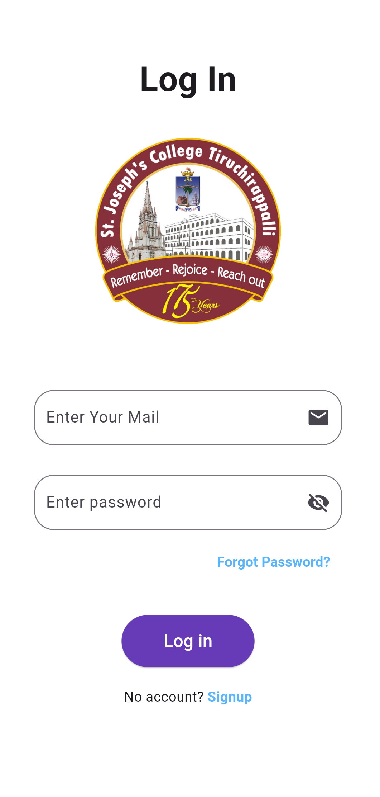
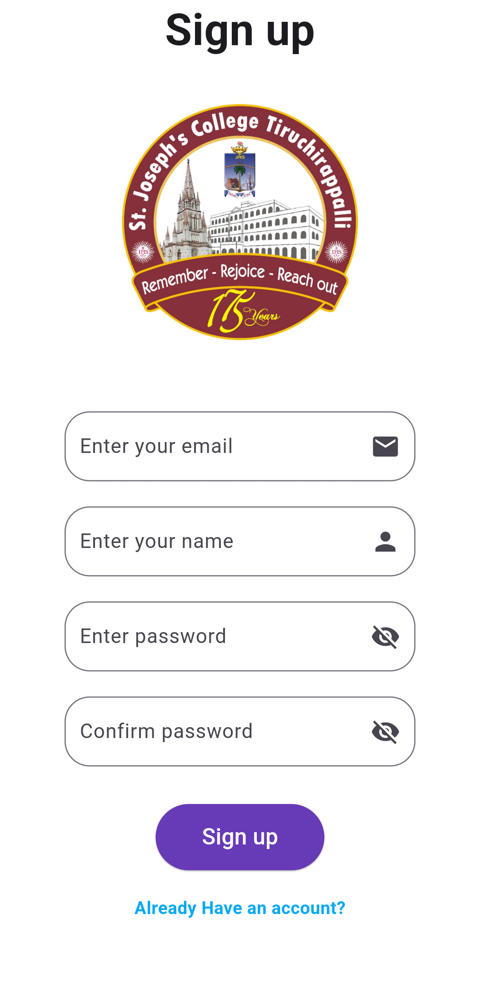
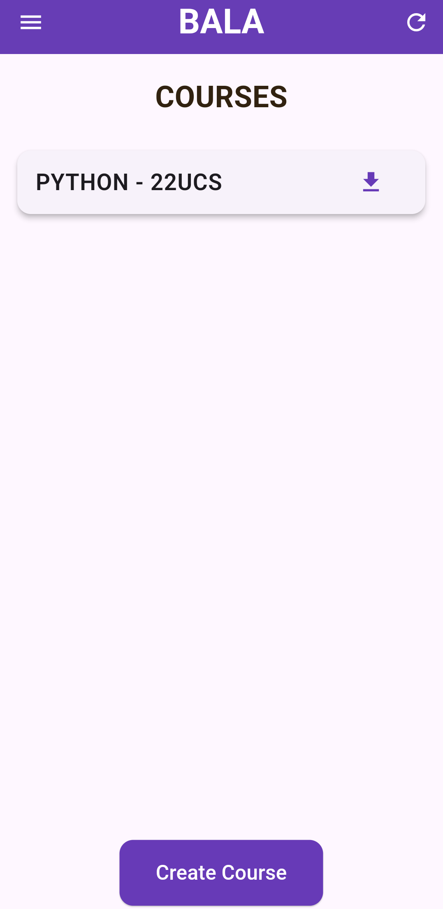
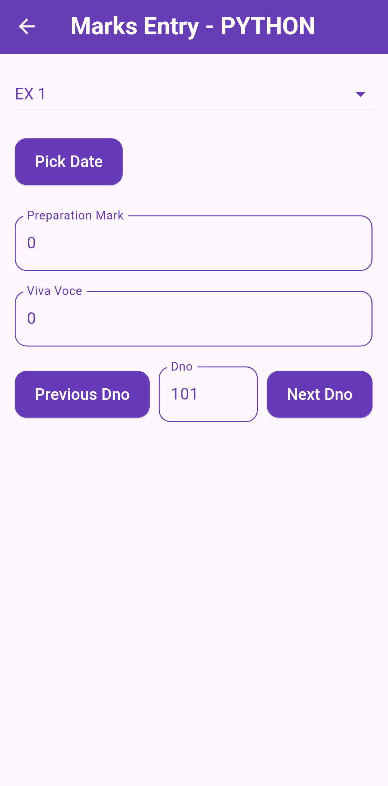
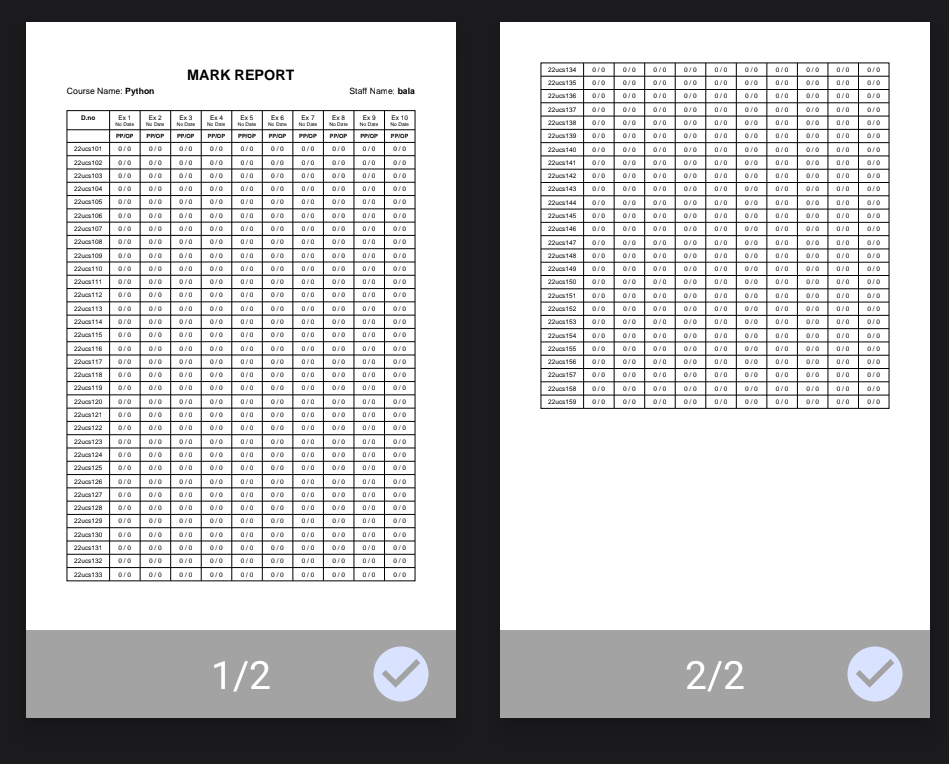

# 📋 Lab Mark Entry Application

A secure, collaborative, and cross-platform app for entering and managing lab marks.  
Built as a **final year UG project** — works on **Android, iOS, and Web**!

---

## ✨ Features

✅ **Secure Staff Login** — Staff can log in securely using **Firebase Authentication**.  
✅ **Password Reset** — Forgot your password? No worries — reset it from the app.  
✅ **Collaboration** — If two staff members are assigned to the same lab section, both can collaboratively manage the same course.  
✅ **PDF Export** — Entered marks can be downloaded as a **well-structured PDF** for offline use.  
✅ **Cross-Platform** — Works seamlessly on **Android**, **iOS**, and **Web**.

---

## 📖 About

This application is designed for staff to enter and manage **lab preparation marks** and **viva voce marks** of students efficiently.  
It ensures secure access, supports multiple staff per course, and generates clean PDF reports for easy record keeping.

---

## 🚀 Tech Stack

- **Frontend:** Flutter
- **Backend/Auth:** Firebase Authentication
- **PDF Generation:** [`pdf`](https://pub.dev/packages/pdf) package from Dart
- **Platforms:** Android, iOS, Web

---

## 📷 Screenshots

## 📷 Screenshots

### 🔐 Login Screen


### 📝 Sign Up Screen 


### 📄 Home Screen 


### 📝 Mark Entry Screen 


### 📄 PDF Download Screen 



## 🔗 Links

- [Live Demo](#) (if hosted)
- [APK Download](#) (optional)
- [Project Report](#) (optional)

---

## 🛠️ How to Run

1️⃣ Clone the repository:
```bash
git clone https://github.com/your-username/your-repo-name.git
cd your-repo-name
